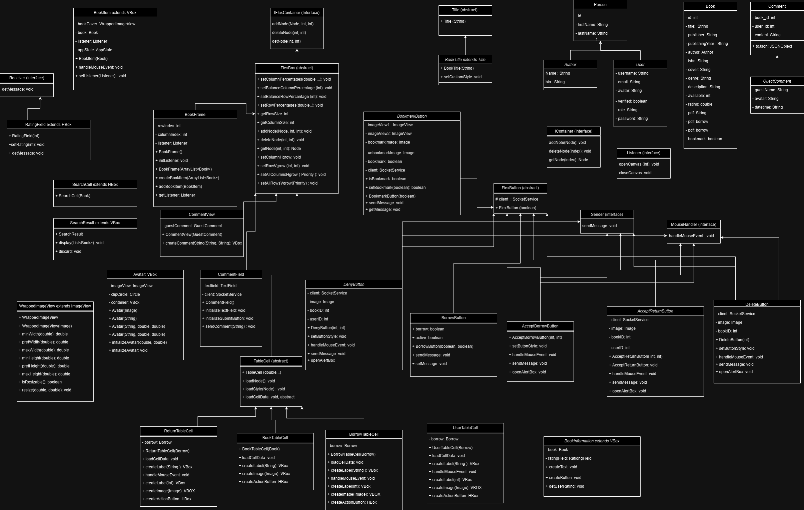
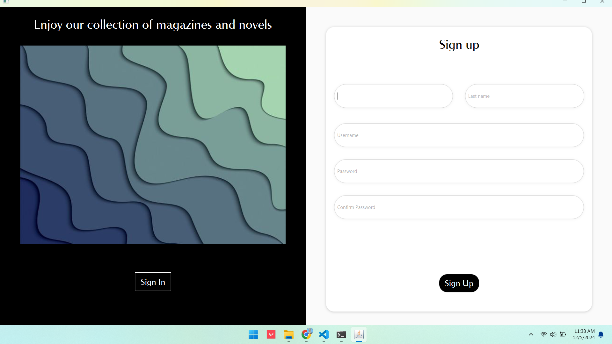
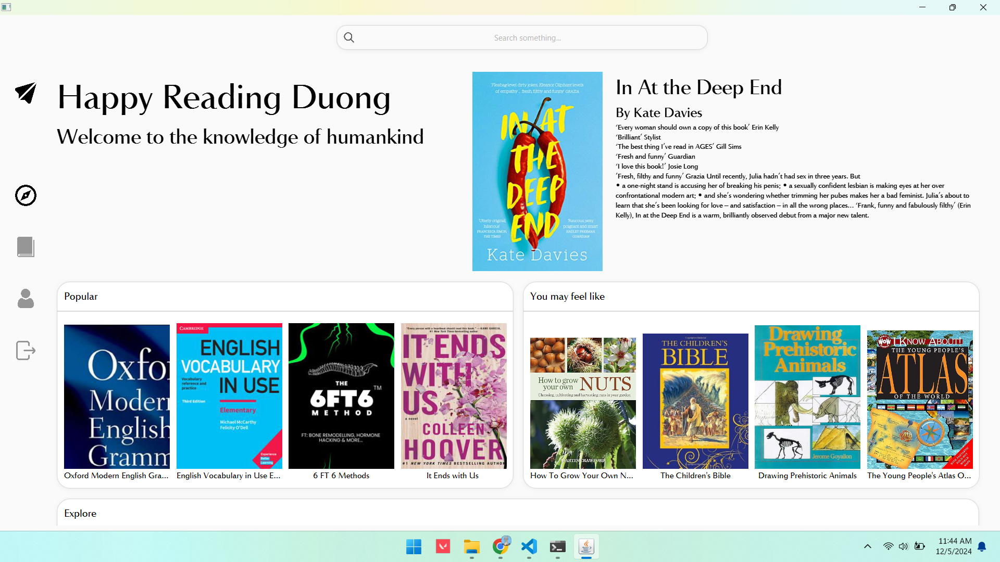
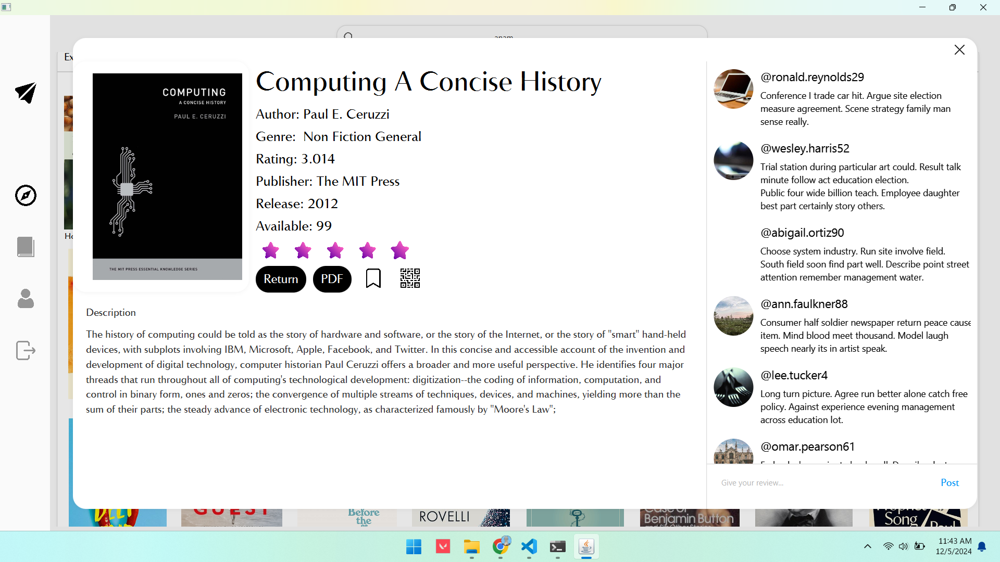
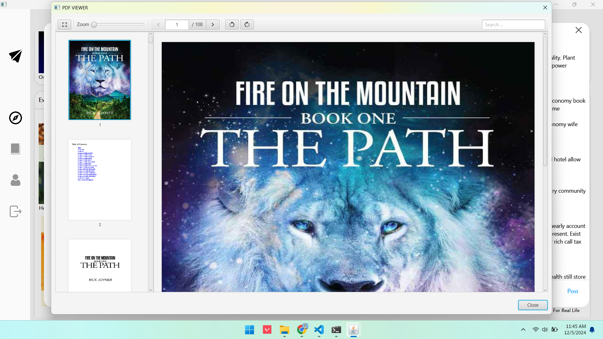
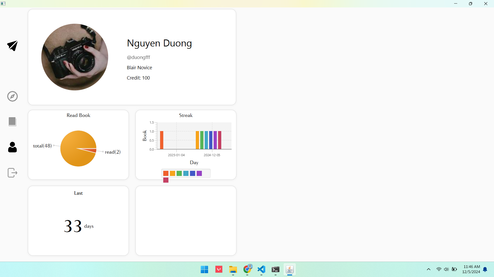
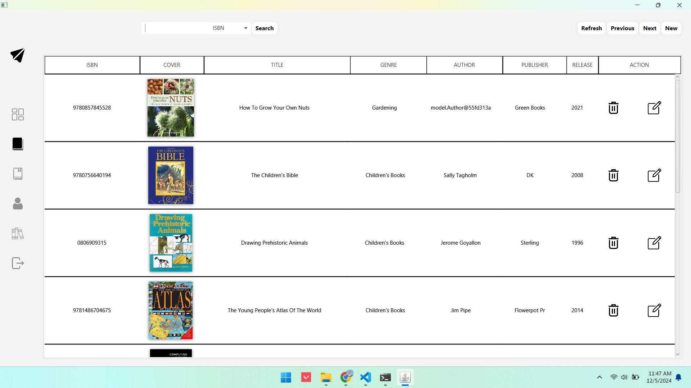
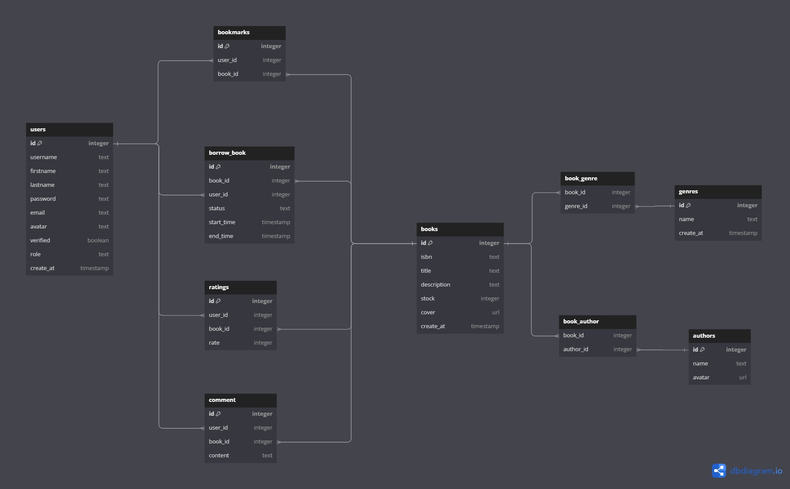

# Blair
Better than VNU-LIC (or equal to)

# Library Management App

## Inheritance Tree



## I. Description
Transform the way you use your library with our Library Management App. Designed to make it easy for bibiophiles to effortlessly manage book inventories, track borrowed books, and discover new reads. Whether you're a small community library or a larger institution, our app offers a user-friendly interface and robust features to simplify your e-library experience.


## II. Features
1. User Accounts:
   - The User Accounts feature allows patrons to create personalized accounts within the app. Users can sign up with their email addresses and create secure passwords.
   - Once logged in, users can view their borrowing history, current loans, and any outstanding fees or notifications.
   - The account dashboard provides quick access to key functions such as borrowing new books, returning items, and updating account information.
   - Admin accounts have additional privileges, including the ability to manage user accounts, reset passwords, and monitor user activity to enhance library services.
   - Users can easily update their personal information, such as contact details and password, ensuring their accounts remain secure and up-to-date.

2. Borrow: 
   - The Borrow feature allows users to easily check out books from the library’s collection. Users can browse through the available inventory including new arrival, popular and feature books.
   - Upon selecting a book, users can view essential details, including the title, author, publication date, and a brief description, as well as read what others are saying and leave their own rating 
   - Once a selection is made, users can confirm their borrow request, which updates the system to reflect the books as checked out under their account.

3. Return:
   - The Return feature simplifies the process of returning borrowed books. Users can view their current loans and select one or multiple books they wish to return.
   - The return process is initiated with a single click on the same interface as borrowing, updating the inventory and marking the book as available for other patrons.

4. Inventory Management:
   - The Inventory Management feature provides a comprehensive system for managing all library materials, including books, magazines, and multimedia items.
   - Admin users can add new items to the inventory by entering details such as title, author, ISBN, genre, publication date, and cover image.
   - The system supports editing existing entries, allowing for updates to details or conditions of the items.
   - Admins can categorize and filter items based on various criteria such as genre, author, or publication year, making it easy to navigate the collection.
   - Inventory statistics and reports can be generated to analyze borrowing trends, popular titles, and overall library usage, aiding in effective resource planning.

5. Recommendations: 
   - The Recommendations feature enhances the user experience by providing personalized book suggestions based on the user’s borrowing history and preferences.
   - Users can also explore curated lists of popular books, new arrivals, and staff picks, promoting a diverse reading experience.
   - The application allows users to rate books they have read, which further refines the recommendation algorithm over time.
   


## III. Installation

### A. Prerequisites
Before you begin, ensure you have the following installed on your machine:

1. **Java Development Kit (JDK)**:
   - Make sure you have JDK 8 or higher installed. You can check your Java version by running:
     ```bash
     java -version
     ```

2. **Apache Maven**:
   - Ensure you have Maven installed. You can verify your Maven installation by running:
     ```bash
     mvn -v
     ```
3. **Python dependencies**:
   - Ensure you have Python installed. You can verify your Python installation by running:
     ```bash
     python --version
     ```

     After that, install python library:
     - go to server, run this command
     ```bash
     pip install -r requirements.txt 
     ```

### B. Steps
1. **Clone the Repository**:
   - Open your terminal and run the following command to clone the repository:
     ```bash
     git clone https://github.com/projerk/Blair.git
     ```

2. **Navigate to the Project Directory**:
   - Change into the project directory:
     ```bash
     cd Blair
     ```

3. **Build the Project**:
   - Use Maven to build the project and download the necessary dependencies:
     ```bash
     mvn clean install
     ```

4. **Run the Application**:
   - After the build is successful, you can run the application using:
     ```bash
     mvn exec:java
     ```

5. **Run the server**:
   - After run successfully, you will have to run the server:
   - go to server file:
     ```bash
     py (or python ) app.py
     ```

   - if the terminal have client connected, it mean you have connected to the server.

## IV. Usage
To start using the application:
1. Launch the app.
2. Create a new user or log in using existing credentials.
3. Explore functionalities such as adding books, borrowing, and returning books.

### Screenshots










## V. Technologies Used

- **Frontend**: JavaFX
- **Backend**: Flask
- **Design Patterns**: Observer, Singleton


## VI. Contact & Acknowledgments

- **Nguyễn Đức Dương**
  - **Email**: 23021510@vnu.edu.vn
  - **GitHub**: https://github.com/duon9
  - **Works on**:  Backend development, including abstract components, interfaces, and media handling.

- **Phạm Nhật Minh**
  - **Email**: 23021634@vnu.edu.vn
  - **GitHub**: https://github.com/nhatminz
  - **Works on**:  Canvas implementation, user profile features, and related file management.

- **Lê Sỹ Thái Sơn**
  - **Email**: 23021682@vnu.edu.vn
  - **GitHub**: https://github.com/SonLeUET
  - **Works on**:  Development of login systems, main application features, and administrative functionalities.

- **Trần Minh Nam**
  - **Email**: 23021646@vnu.edu.vn
  - **GitHub**: https://github.com/MothMalone
  - **Works on**:   Exploration features and book viewing/control functionalities, along with related file management.
